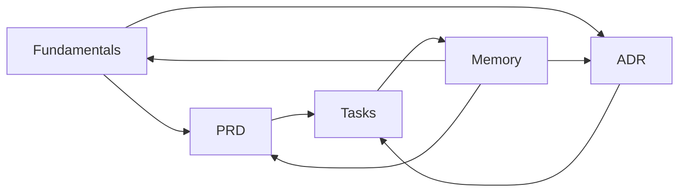

# Traceability Model

Traceability ensures that implementation work can always be traced back to business intent and technical decisions.

## Canonical Flow

## Link Contract

Use these link rules in every artifact:

- **PRD**
  - references fundamentals as constraints
  - references ADR IDs where decisions already exist
- **ADR**
  - references impacted PRD feature IDs
  - references related ADRs when decisions compose
- **Task**
  - references source PRD/ADR IDs in frontmatter (`source`)
  - includes explicit checklist for PRD/ADR updates
- **Memory**
  - references task IDs and optionally PRD/ADR IDs
  - documents what should change in standards or docs

## ID Conventions

- PRDs: `PRD-01`, `PRD-02`, ...
- ADRs: `ADR-01`, `ADR-02`, ...
- Tasks: `TASK-01`, `TASK-02`, ...
- Features inside PRD: `F-01`, `F-02`, ...

IDs should remain stable even if titles change.

## Traceability Checks (Definition of Healthy Planning)

- Every active task links to at least one source PRD/ADR.
- Every completed task has PRD/ADR update checks resolved.
- Every accepted ADR references concrete impacted scope.
- Every PRD feature has either:
  - planned tasks, or
  - an explicit reason why no implementation task is needed.

## Anti-Drift Rules

- Do not mark tasks done while ADR/PRD update checkboxes are open.
- Do not supersede an ADR without linking replacement ADR(s).
- Do not change terminology without updating `memory/conventions.md`.
- Do not close implementation cycles without at least one memory pass.
